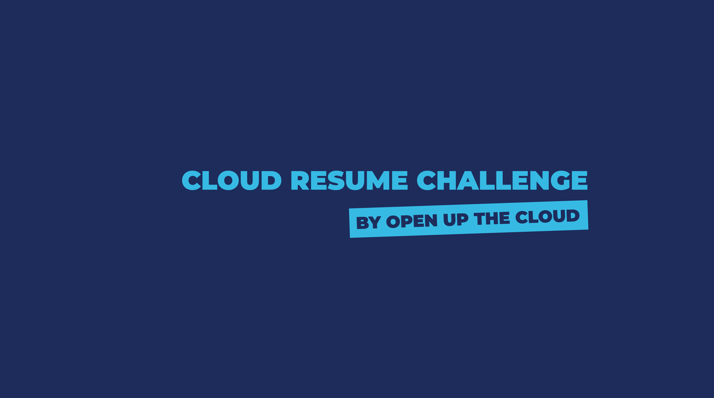

The [cloud resume challenge](https://cloudresumechallenge.dev/) is a challenge to help people to prepare for a job in the cloud industry. It's totally free (if you do it "right!"), and it's open to anyone. This repo is for accompanying code for a tutorial series on YouTube. 

To use this repo 👉 **check out the branches for each section** 👈

You can watch the accompanying [video series on YouTube](https://www.youtube.com/channel/UCAklaE5D59xWtip-3Jwa7xA)

## Blogs

_A list of completed blog posts, useful for inspiration and ideas_

* https://dev.to/aws-builders/cloud-resume-challenge-my-journey-50db
* https://blog.heyitschris.com/posts/cloud-resume-challenge/
* https://dev.to/thakurrishabh/portfolio-resume-serverless-website-cloud-resume-challenge-18ln
* https://seanjziegler.com/how-to-build-a-free-static-resume-site-with-aws-s3-cloudfront-and-route-53/
* https://dev.to/kyronmckenna/the-cloud-resume-challenge-a-great-learning-experience-2lep
* https://dev.to/donofriov/cloud-resume-challenge-11a2
* https://dev.to/therealbolaji/cloud-resume-challenge-4kfb
* https://dev.to/daniels1996/plumber-s-guide-to-cloud-88
* https://erichallow.cloud/cloud-resume-challenge-ckg1f6bhb01oiw6s1dd5399qv

If you want to put your post here, just send over a PR!
